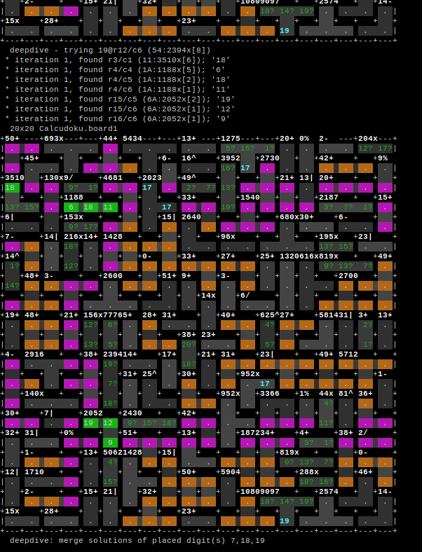
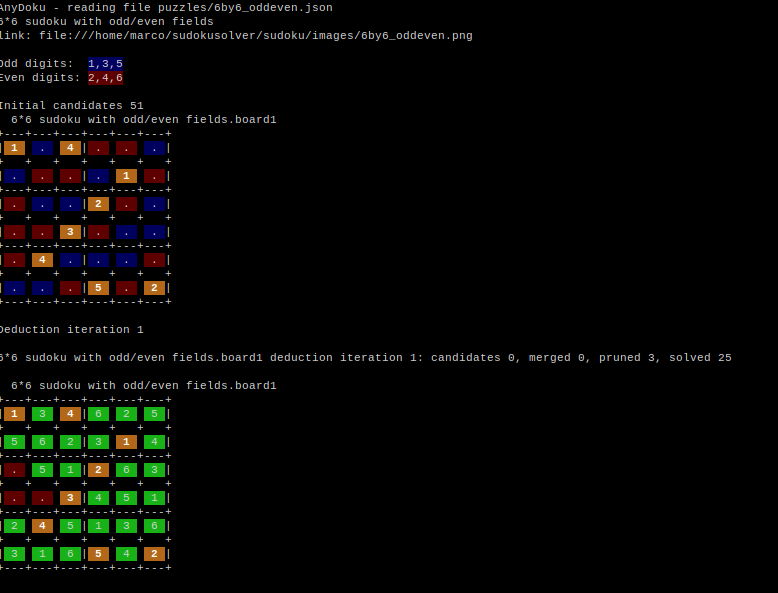
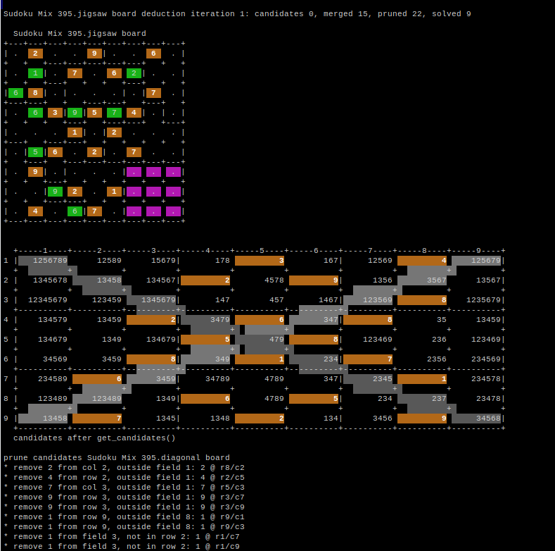

# anydoku-sudoku-solver
Versatile solver for any sudoku type, single/multi board, any size, jigsaw, multifield, oddeven, diagonal, calcudoku, killer etc.
With nice examples of the famous Elektor penta-hexadoku of 2012 and the so called 'largest calcudoku'.

What is anydoku?
----------------

Console application to solve (potentially) all kinds of Sudoku puzzles. 
Run it in a terminal with ANSI color support: 

````
$ pip install -r requirements.txt

$ python3 anydoku.py <arguments> 
````

[anydoku.py](anydoku.py) is a wrapper around the classes that do the real work:

* [BoardReader](Sudoku/BoardReader.py): 
   reader for anydoku JSON files. 
   
   You have to write a JSON input file to define a puzzle you want to get solved. 
    To get started, please check the example files (notably the [regular.json](puzzles/regular.json) ) 

````
{
"name": "Regular sudoku",
"grid": [
	"1..92....", 
	"524.1....",
	".......7.",
	".5...81.2",
	".........",
	"4.27...9.",
	".6.......",
	"....3.945",
	"....71..6"
	],

"boards": [ 
	{
	}
] 


}
````

* [SudokuBoard](Sudoku/SudokuBoard.py): 
   Base class, tool box with operations and helper functions in the scope of a single Sudoku board. 
   
   The data tables and operation break-down are designed to be as general and flexible as possible.
    For example, a 'field' is implemented as a group of cells that contain all numbers ('digits') once.
    This can then be handled equally for the square fields in a regular Sudoku, extra fields, diagonal fields, jigsaw fields etc.
    Calcudoku puzzles are supported by [CalcudokuBoard](Sudoku/CalcudokuBoard.py) which is a sub-class of SudokuBoard. This sub-classing is an example
    of extending the features of the base class. You can also define a sub-class to implement new features. The idea is though 
    to merge new features into the base class at some point, so that puzzles using multiple features can be solved. 
    It also supports a brute force solver for simple puzzles.

Further functions in [anydoku.py](anydoku.py):

* command line parser
    Run 'python3 anydoku.py -h' for help on the command line arguments

* merge_overlaps(): 
    Used to merge the results of puzzles with multiple overlapping boards
    
    Since the SudokuBoard and sub-classes operate on single boards the merging is done here. This also means that boards of 
    different types can be successfully merged. 
    
* deduction_loop(): 
    iterative deduction solver
    
    The solver loops over these operations for each board in the puzzle:
    1. get candidates:    determine which digits can be placed in each cell
    2. merge_overlaps:    does nothing unless there are overlapping boards 
    3. prune candidates:  tries to eliminate digits per cell
    4. find solutions:    detects where cells can be fixed 
    
* guessing_loop(): wraps the deduction loop and starts guessing if needed

General remarks
---------------

This is a pure python implementation with virtually no external dependencies.
* only a few python modules are needed (run 'pip install -r requirements.txt') 
* Has the benefit to be easy to understand and extend (this is work in progress, any help is welcome ;-)
* Is cross-platform
* Execution speed is always a concern with Python. Therefore the implementation focuses on optimized algorithms and the 
  reduction of table sizes and unnecessary loops. The larger example puzzles have been used to detect bottle necks.

Sudoku boards are represented in a text console
* Uses best-effort ASCII art to print the boards in progress
* This has certainly its limitations but does the job well with the help of color mappings
* A graphical wrapper would be a good idea though, but that's a project in itself ...  

Screen shots
------------

[20x20 Calcudoku aka Largest Calcudoku](images/screenshot1.png)
<p></p>

[6x6 odd/even Sudoku](images/screenshot2.png)
<p></p>

[Overlapping jigsaw and diagonal Sudokus](images/screenshot3.png)
<p></p>


--> I hope you enjoy it!
